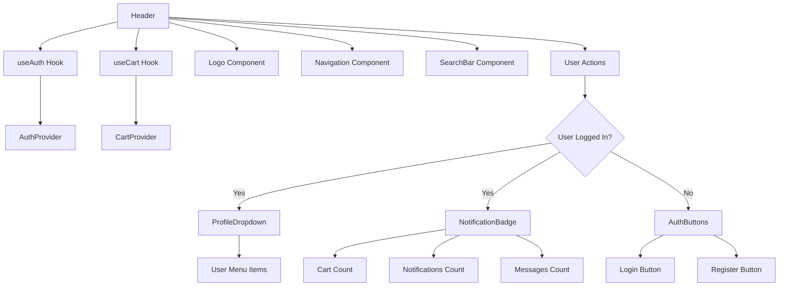
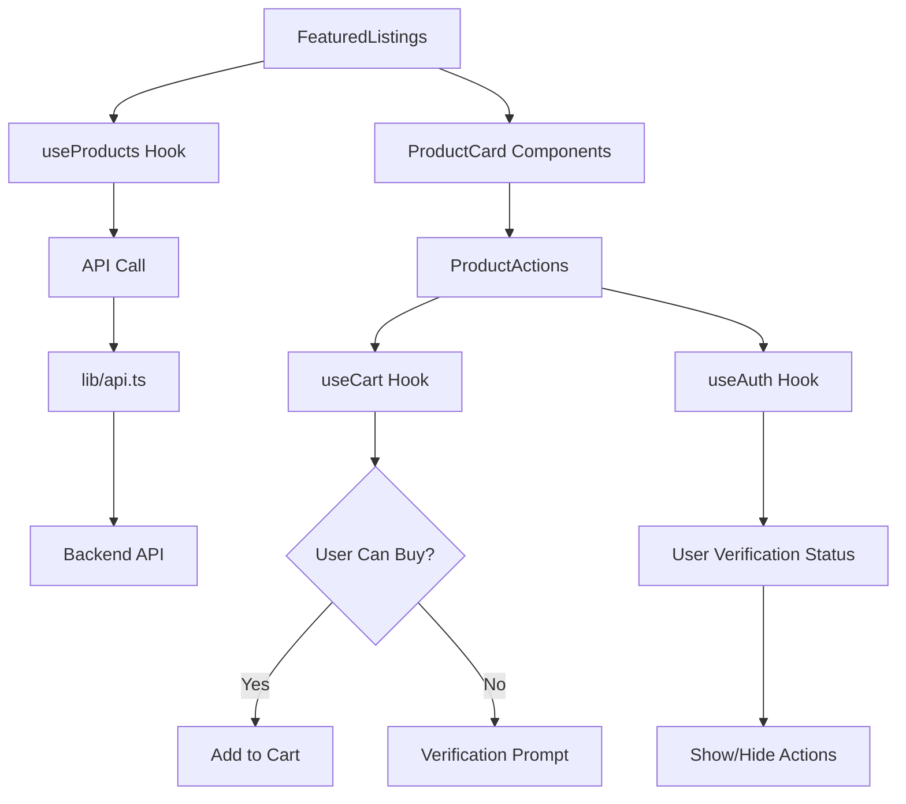
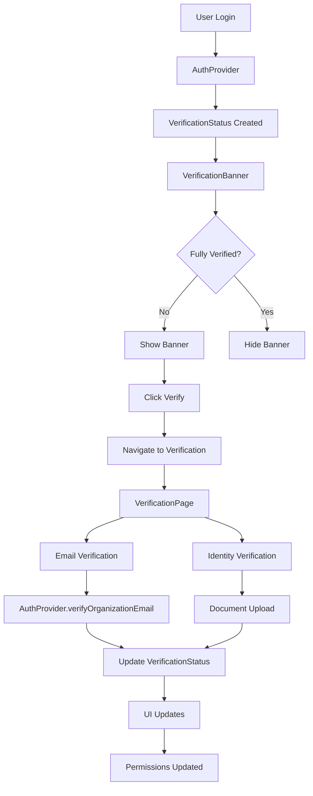

# Component Connections & Data Flow Guide

## Overview

This document maps out how all components, hooks, providers, and pages in the GlobalExpat Marketplace connect and communicate with each other. It serves as a visual and technical guide to understanding the data flow and component relationships.

## Table of Contents

1. [Application Architecture](#application-architecture)
2. [Provider Hierarchy](#provider-hierarchy)
3. [Component Data Flow](#component-data-flow)
4. [Authentication Flow](#authentication-flow)
5. [Shopping Cart Flow](#shopping-cart-flow)
6. [Navigation and Routing](#navigation-and-routing)
7. [API Integration Points](#api-integration-points)
8. [Error Handling Flow](#error-handling-flow)
9. [Verification System](#verification-system)
10. [Performance Optimizations](#performance-optimizations)

## Application Architecture

### High-Level Component Tree

```
app/layout.tsx (Root Layout)
├── AuthProvider (providers/auth-provider.tsx)
│   ├── CartProvider (providers/cart-provider.tsx)
│   │   ├── ErrorBoundary (components/error-boundary.tsx)
│   │   │   ├── Header (components/header.tsx)
│   │   │   │   ├── Logo (components/header/logo.tsx)
│   │   │   │   ├── Navigation (components/header/navigation.tsx)
│   │   │   │   ├── SearchBar (components/search-bar.tsx)
│   │   │   │   ├── AuthButtons (components/header/auth-buttons.tsx)
│   │   │   │   ├── NotificationBadge (components/header/notification-badge.tsx)
│   │   │   │   ├── ProfileDropdown (components/header/profile-dropdown.tsx)
│   │   │   │   └── MobileMenu (components/header/mobile-menu.tsx)
│   │   │   ├── VerificationBanner (components/verification-banner.tsx)
│   │   │   ├── Breadcrumb (components/breadcrumb.tsx)
│   │   │   ├── Main Content (app/*/page.tsx)
│   │   │   │   ├── Homepage (app/page.tsx)
│   │   │   │   │   ├── HeroCarousel (components/hero-carousel.tsx)
│   │   │   │   │   ├── FeaturedListings (components/featured-listings.tsx)
│   │   │   │   │   ├── CategorySidebar (components/category-sidebar.tsx)
│   │   │   │   │   └── TrustIndicators (components/trust-indicators.tsx)
│   │   │   │   ├── Product Pages (app/product/[id]/page.tsx)
│   │   │   │   ├── Cart Page (app/cart/page.tsx)
│   │   │   │   ├── Authentication (app/login/page.tsx, app/register/page.tsx)
│   │   │   │   └── User Account (app/account/*/page.tsx)
│   │   │   └── Footer (components/footer.tsx)
│   │   └── Toaster (components/ui/toaster.tsx)
│   └── Various Modals and Dialogs
└── Theme Provider (components/theme-provider.tsx)
```

## Provider Hierarchy

### 1. AuthProvider (providers/auth-provider.tsx)

**Purpose**: Manages global authentication state and user data

**Dependencies**:

- `lib/types.ts` - User and VerificationStatus types
- `localStorage` - Session persistence

**Provides**:

```typescript
interface AuthContextType {
  // State
  user: User | null
  isLoggedIn: boolean
  isLoading: boolean
  error: string | null
  verificationStatus: VerificationStatus | null

  // Actions
  login: (userData: Partial<User>) => Promise<void>
  logout: () => Promise<void>
  updateUser: (userData: Partial<User>) => void
  verifyOrganizationEmail: (email: string) => Promise<void>

  // Computed Properties
  canBuy: boolean
  canSell: boolean
  canContact: boolean
  isVerifiedBuyer: boolean
  isFullyVerified: boolean
  isAdmin: boolean
}
```

**Connected Components**:

- ✅ `components/header.tsx` - User status display
- ✅ `components/verification-banner.tsx` - Verification prompts
- ✅ `app/login/page.tsx` - Authentication UI
- ✅ `app/register/page.tsx` - User registration
- ✅ `app/account/*/page.tsx` - Account management
- ✅ `components/route-guard.tsx` - Protected routes

### 2. CartProvider (providers/cart-provider.tsx)

**Purpose**: Manages shopping cart state and operations

**Dependencies**:

- `hooks/use-auth.ts` - User authentication status
- `localStorage` - Cart persistence
- `components/ui/use-toast.ts` - User notifications

**Provides**:

```typescript
interface CartContextType {
  // State
  items: CartItem[]
  isLoading: boolean
  error: string | null

  // Computed Properties
  itemCount: number
  subtotal: number
  savings: number
  isEmpty: boolean

  // Actions
  addToCart: (product: CartItem, quantity?: number) => Promise<void>
  removeFromCart: (itemId: string) => Promise<void>
  updateQuantity: (itemId: string, quantity: number) => Promise<void>
  clearCart: () => Promise<void>
}
```

**Connected Components**:

- ✅ `components/header.tsx` - Cart count display
- ✅ `components/product-actions.tsx` - Add to cart buttons
- ✅ `app/cart/page.tsx` - Cart management
- ✅ `app/checkout/page.tsx` - Purchase flow
- ✅ `components/featured-listings.tsx` - Product cards

## Component Data Flow

### Header Component Flow



### Product Listing Flow



## Authentication Flow

### Login Process

1. **User Access**: User navigates to `/login`
2. **Component Load**: `app/login/page.tsx` renders
3. **Form Submission**: User enters credentials
4. **Validation**: Client-side validation checks
5. **API Call**: `lib/api.ts` → `POST /api/auth/login`
6. **Provider Update**: `AuthProvider.login()` called
7. **State Update**: Global auth state updated
8. **UI Update**: Header, navigation, and protected routes update
9. **Redirect**: User redirected to dashboard or intended page

### Logout Process

1. **User Action**: User clicks logout button
2. **Provider Call**: `AuthProvider.logout()` called
3. **State Clear**: User data and session cleared
4. **Storage Clear**: localStorage cleaned
5. **Cart Clear**: `CartProvider` clears cart items
6. **UI Update**: All components reflect logged-out state
7. **Redirect**: User redirected to homepage

### Component Connections for Auth

```typescript
// Header Component
const Header = () => {
  const { isLoggedIn, user, logout } = useAuth() // ← AuthProvider

  if (isLoggedIn) {
    return <UserNavigation user={user} onLogout={logout} />
  }
  return <AuthButtons />
}

// Protected Route Component
const ProtectedRoute = ({ children }) => {
  const { isLoggedIn, isLoading } = useAuth() // ← AuthProvider

  if (isLoading) return <LoadingSpinner />
  if (!isLoggedIn) return <Navigate to="/login" />
  return children
}

// Product Actions Component
const ProductActions = ({ product }) => {
  const { canBuy } = useAuth() // ← AuthProvider
  const { addToCart } = useCart() // ← CartProvider

  const handleAddToCart = () => {
    if (!canBuy) {
      // Show verification prompt
      return
    }
    addToCart(product)
  }
}
```

## Shopping Cart Flow

### Add to Cart Process

1. **User Action**: User clicks "Add to Cart" button
2. **Permission Check**: `useAuth().canBuy` verification
3. **Cart Action**: `CartProvider.addToCart()` called
4. **Validation**: Item and quantity validation
5. **State Update**: Cart items array updated
6. **Persistence**: localStorage updated
7. **UI Update**: Cart count badge updates
8. **Notification**: Toast notification shown

### Cart Management

```typescript
// Product Card Component
const ProductCard = ({ product }) => {
  const { addToCart, isInCart } = useCart() // ← CartProvider
  const { canBuy } = useAuth() // ← AuthProvider

  const handleAddToCart = async () => {
    if (!canBuy) {
      // Redirect to verification
      return
    }

    await addToCart({
      id: product.id,
      title: product.title,
      price: product.price,
      // ... other required fields
    })
  }

  return (
    <Card>
      <CardContent>
        <h3>{product.title}</h3>
        <p>{product.price}</p>
        <Button
          onClick={handleAddToCart}
          disabled={!canBuy}
        >
          {isInCart(product.id) ? 'In Cart' : 'Add to Cart'}
        </Button>
      </CardContent>
    </Card>
  )
}

// Cart Page Component
const CartPage = () => {
  const {
    items,
    itemCount,
    subtotal,
    removeFromCart,
    updateQuantity
  } = useCart() // ← CartProvider

  return (
    <div>
      <h1>Shopping Cart ({itemCount} items)</h1>
      {items.map(item => (
        <CartItem
          key={item.id}
          item={item}
          onRemove={removeFromCart}
          onUpdateQuantity={updateQuantity}
        />
      ))}
      <CartSummary subtotal={subtotal} />
    </div>
  )
}
```

## Navigation and Routing

### Route Structure and Components

```
app/
├── layout.tsx                    # Root layout with providers
├── page.tsx                      # Homepage → FeaturedListings, HeroCarousel
├── login/page.tsx               # Login form → AuthProvider.login()
├── register/page.tsx            # Registration → AuthProvider.login()
├── browse/page.tsx              # Product browsing → useProducts, CategorySidebar
├── product/[id]/page.tsx        # Product details → ProductActions, useCart
├── cart/page.tsx                # Cart management → useCart
├── checkout/page.tsx            # Purchase flow → useCart, useAuth
├── account/
│   ├── page.tsx                 # Account dashboard → useAuth
│   ├── orders/page.tsx          # Order history → useAuth, API calls
│   ├── settings/page.tsx        # User settings → useAuth.updateUser
│   └── verification/page.tsx    # Verification flow → useAuth
├── sell/page.tsx                # Selling interface → useAuth (canSell check)
├── messages/page.tsx            # Messaging → useAuth, MessagesProvider
└── admin/
    └── dashboard/page.tsx       # Admin panel → useAuth (admin check)
```

### Navigation Component Connections

```typescript
// Navigation Component
const Navigation = ({ isLoggedIn, isAdmin }) => {
  return (
    <nav>
      <NavLink href="/">Home</NavLink>
      <NavLink href="/browse">Browse</NavLink>

      {isLoggedIn && (
        <>
          <NavLink href="/sell">Sell</NavLink>
          <NavLink href="/account">Account</NavLink>
          <NavLink href="/messages">Messages</NavLink>
        </>
      )}

      {isAdmin && (
        <NavLink href="/admin">Admin</NavLink>
      )}
    </nav>
  )
}

// Breadcrumb Component
const Breadcrumb = () => {
  const pathname = usePathname()
  const breadcrumbs = generateBreadcrumbs(pathname)

  return (
    <nav aria-label="Breadcrumb">
      {breadcrumbs.map((crumb, index) => (
        <Link key={index} href={crumb.href}>
          {crumb.label}
        </Link>
      ))}
    </nav>
  )
}
```

## API Integration Points

### API Client Structure

```typescript
// lib/api.ts - Centralized API client
export const api = {
  // Authentication
  auth: {
    login: (email: string, password: string) => apiClient.login(email, password),
    register: (userData: any) => apiClient.register(userData),
    logout: () => apiClient.logout(),
  },

  // Products
  products: {
    list: (params?: ProductListParams) => apiClient.getProducts(params),
    get: (id: string) => apiClient.getProduct(id),
    create: (data: any) => apiClient.createProduct(data),
  },

  // User Management
  users: {
    get: (id: string) => apiClient.getUser(id),
    update: (id: string, data: any) => apiClient.updateUser(id, data),
  },

  // Cart & Orders
  cart: {
    sync: (items: CartItem[]) => apiClient.syncCart(items),
  },

  orders: {
    list: () => apiClient.getOrders(),
    create: (data: any) => apiClient.createOrder(data),
  },
}
```

### Component → API Flow

```typescript
// useProducts Hook
const useProducts = (category?: string) => {
  const [products, setProducts] = useState<Product[]>([])
  const [loading, setLoading] = useState(true)

  useEffect(() => {
    const fetchProducts = async () => {
      try {
        const response = await api.products.list({ category })
        setProducts(response.data)
      } catch (error) {
        console.error('Failed to fetch products:', error)
      } finally {
        setLoading(false)
      }
    }

    fetchProducts()
  }, [category])

  return { products, loading }
}

// Component Usage
const ProductsList = () => {
  const { products, loading } = useProducts() // ← Custom hook

  if (loading) return <LoadingSpinner />

  return (
    <div>
      {products.map(product => (
        <ProductCard key={product.id} product={product} />
      ))}
    </div>
  )
}
```

## Error Handling Flow

### Error Boundary Hierarchy

```
ErrorBoundary (level: page, name: Application)
├── ErrorBoundary (level: component, name: Header)
│   └── Header Component
├── ErrorBoundary (level: component, name: Breadcrumb)
│   └── Breadcrumb Component
├── ErrorBoundary (level: page, name: Main Content)
│   └── Page Components
│       ├── ErrorBoundary (level: component, name: Product List)
│       │   └── FeaturedListings
│       └── ErrorBoundary (level: component, name: User Actions)
│           └── ProductActions
└── ErrorBoundary (level: component, name: Footer)
    └── Footer Component
```

### Error Flow Implementation

```typescript
// Error Boundary Component
const ErrorBoundary = ({
  level,
  name,
  children
}: ErrorBoundaryProps) => {
  const [hasError, setHasError] = useState(false)
  const [error, setError] = useState<Error | null>(null)

  useEffect(() => {
    const handleError = (error: ErrorEvent) => {
      setHasError(true)
      setError(new Error(error.message))

      // Log error with context
      console.error(`Error in ${level}:${name}:`, error)
    }

    window.addEventListener('error', handleError)
    return () => window.removeEventListener('error', handleError)
  }, [level, name])

  if (hasError) {
    return <ErrorFallback error={error} level={level} name={name} />
  }

  return children
}

// Component Error Handling
const FeaturedListings = () => {
  const { products, loading, error } = useProducts()

  if (error) {
    return <ErrorMessage error={error} />
  }

  if (loading) {
    return <LoadingSpinner />
  }

  return (
    <div>
      {products.map(product => (
        <ProductCard key={product.id} product={product} />
      ))}
    </div>
  )
}
```

## Verification System

### Verification Component Flow



### Verification Status Usage

```typescript
// Verification Banner Component
const VerificationBanner = () => {
  const { verificationStatus, currentVerificationStep } = useAuth()

  if (!verificationStatus || verificationStatus.isFullyVerified) {
    return null
  }

  return (
    <Banner variant="warning">
      <p>Complete verification to access all features</p>
      <Button asChild>
        <Link href="/account/verification">
          {currentVerificationStep === 'organization'
            ? 'Verify Email'
            : 'Upload Documents'
          }
        </Link>
      </Button>
    </Banner>
  )
}

// Product Actions with Verification
const ProductActions = ({ product }) => {
  const { canBuy, canSell, verificationStatus } = useAuth()
  const { addToCart } = useCart()

  const getActionButton = () => {
    if (!canBuy) {
      return (
        <Button variant="outline" asChild>
          <Link href="/account/verification">
            Verify to Buy
          </Link>
        </Button>
      )
    }

    return (
      <Button onClick={() => addToCart(product)}>
        Add to Cart
      </Button>
    )
  }

  return (
    <div>
      {getActionButton()}
      <ContactSellerButton
        disabled={!verificationStatus?.canContact}
        sellerId={product.sellerId}
      />
    </div>
  )
}
```

## Performance Optimizations

### Memoization Strategy

```typescript
// Header Component - Memoized for performance
const Header = memo(() => {
  const { isLoggedIn, user, logout } = useAuth()
  const { itemCount } = useCart()

  // Memoized user navigation to prevent re-renders
  const userNavigation = useMemo(() => {
    if (!isLoggedIn) return null

    return (
      <UserNavigation
        user={user}
        cartItemCount={itemCount}
        onLogout={logout}
      />
    )
  }, [isLoggedIn, user, itemCount, logout])

  return (
    <header>
      <Logo />
      <Navigation />
      {userNavigation}
    </header>
  )
})

// Product Card - Memoized with specific props
const ProductCard = memo(({
  product,
  onAddToCart,
  isInCart
}: ProductCardProps) => {
  // Memoized click handler
  const handleAddToCart = useCallback(() => {
    onAddToCart(product.id)
  }, [onAddToCart, product.id])

  return (
    <Card>
      <CardContent>
        <h3>{product.title}</h3>
        <Button onClick={handleAddToCart}>
          {isInCart ? 'In Cart' : 'Add to Cart'}
        </Button>
      </CardContent>
    </Card>
  )
}, (prevProps, nextProps) => {
  // Custom comparison for memoization
  return (
    prevProps.product.id === nextProps.product.id &&
    prevProps.isInCart === nextProps.isInCart
  )
})
```

### Code Splitting Strategy

```typescript
// Lazy loading for large components
const AdminDashboard = lazy(() => import('./admin/dashboard/page'))
const MessagesPage = lazy(() => import('./messages/page'))
const SellerDashboard = lazy(() => import('./seller/dashboard/page'))

// Route-based code splitting
const AppRoutes = () => {
  return (
    <Routes>
      <Route path="/" element={<HomePage />} />
      <Route path="/browse" element={<BrowsePage />} />

      {/* Lazy loaded routes */}
      <Route
        path="/admin/*"
        element={
          <Suspense fallback={<AdminLoadingSkeleton />}>
            <AdminDashboard />
          </Suspense>
        }
      />

      <Route
        path="/messages"
        element={
          <Suspense fallback={<MessagesLoadingSkeleton />}>
            <MessagesPage />
          </Suspense>
        }
      />
    </Routes>
  )
}
```

## Summary

This component connection system provides:

1. **Clear Data Flow**: Unidirectional data flow from providers to components
2. **Separation of Concerns**: Each component has a specific responsibility
3. **Type Safety**: TypeScript ensures proper data types throughout the flow
4. **Performance**: Memoization and code splitting optimize rendering
5. **Error Handling**: Comprehensive error boundaries protect the application
6. **Scalability**: Modular architecture supports easy feature additions

The architecture ensures that components are loosely coupled but effectively communicate through well-defined interfaces, making the application maintainable and scalable.
