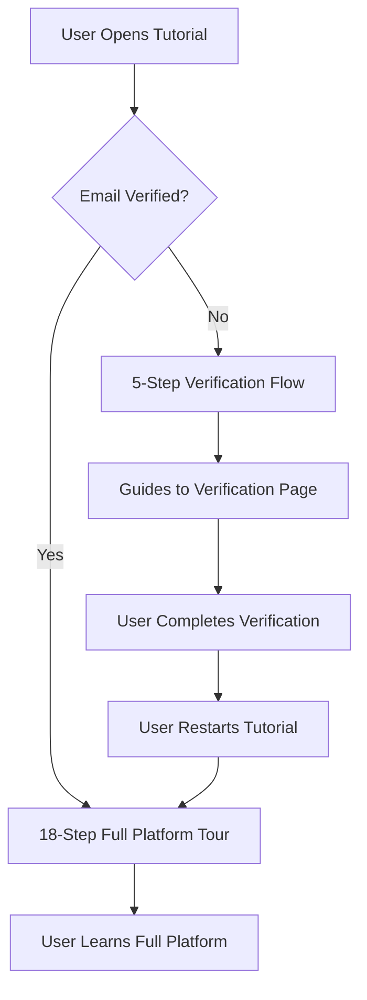

# Tutorial System - Verification-Based Flow

## 🎯 **Overview**

The platform tutorial now adapts dynamically based on the user's email verification status, providing a tailored onboarding experience.

---

## ✨ **Feature Summary**

### **Two Distinct Tutorial Paths**

#### **1. Unverified Users (Short Flow - 5 Steps)**

**Purpose**: Guide users to complete email verification first before exploring the full platform.

**Flow:**

1. **Welcome & Verification Notice** 🌍
   - Emphasizes the need to verify email first
   - Explains benefits of verification (buying, selling, messaging)

2. **Homepage Overview**
   - Brief introduction to the homepage

3. **Account Menu Highlight** 👤
   - Warns that features are locked until verification
   - Prompts user to complete verification

4. **Email Verification Page** 📧
   - Navigates to `/account/verification`
   - Explains what features will be unlocked
   - Lists benefits of verification

5. **Verification Instructions** 🔐
   - Step-by-step guide to complete verification
   - Instructs to restart tutorial after verification for full tour

#### **2. Verified Users (Full Flow - 18 Steps)**

**Purpose**: Comprehensive platform tour covering all features.

**Flow includes:**

- Homepage navigation and features
- Browse/filter functionality
- Sell page and listing creation
- Account dashboard sections
- Settings and verification status
- Messages center
- Complete platform feature tour

---

## 🔧 **Technical Implementation**

### **Dynamic Step Generation**

**File**: `/components/platform-tutorial.tsx`

```typescript
// Check user verification status
const isEmailVerified = userProfile?.verificationStatus?.isOrganizationEmailVerified ?? false

// Generate steps based on verification
const getTutorialSteps = (): DriveStep[] => {
  if (!isEmailVerified) {
    return [
      /* 5-step unverified flow */
    ]
  }

  return [
    /* 18-step verified flow */
  ]
}
```

### **Key Components**

**Imports:**

```typescript
import { useUserProfile } from '@/hooks/use-user-profile'
```

**Verification Check:**

```typescript
const { userProfile } = useUserProfile()
const isEmailVerified = userProfile?.verificationStatus?.isOrganizationEmailVerified ?? false
```

**State Persistence:**

- Uses `sessionStorage` for cross-page state
- Maintains tutorial progress during page navigation
- Restores tutorial on page load if navigating

**Loading Feedback:**

- Shows "Loading next page..." during navigation
- Centered loading popup with spinner
- Smooth transition between pages

---

## 📋 **Unverified User Experience**

### **Step-by-Step Guide**

**Step 1: Welcome**

```
Title: "Welcome to Globoexpats! 🌍"
Message: "Before exploring the full marketplace, let's complete your
         email verification. This unlocks all features including buying,
         selling, and messaging."
```

**Step 2: Homepage**

```
Element: Logo
Title: "Homepage Navigation"
Message: "This is your homepage - you can always return here to browse listings."
```

**Step 3: Account Menu**

```
Element: User Menu
Title: "Your Account Menu 👤"
Message: "⚠️ Notice: Some features are locked until you verify your email.
         Let's complete that now to unlock full access!"
Action: Navigate to /account/verification
```

**Step 4: Verification Page**

```
Title: "Email Verification Page 📧"
Message: "Here you can verify your organization email to unlock all platform features.

✨ After verification, you'll be able to:
• Browse and purchase items
• List your own products
• Message other users
• Access all marketplace features"
```

**Step 5: Instructions**

```
Element: Form
Title: "Verification Steps 🔐"
Message: "1️⃣ Enter your work/organization email (not Gmail, Yahoo, etc.)
         2️⃣ Click 'Send Verification Code'
         3️⃣ Check your email for the 6-digit code
         4️⃣ Enter the code and verify

         Once verified, come back and restart the tutorial to see
         the full platform tour!"
Action: Close tutorial
```

---

## 🎨 **User Benefits**

### **For Unverified Users:**

- **Focused Guidance**: Direct path to unlock platform features
- **Clear Instructions**: Step-by-step verification process
- **Motivation**: Understand what they'll unlock after verification
- **Reduced Confusion**: Shorter tutorial focused on their current need
- **Seamless Transition**: Encouraged to restart for full tour after verification

### **For Verified Users:**

- **Complete Overview**: Full 18-step platform tour
- **Feature Discovery**: Learn all platform capabilities
- **Workflow Understanding**: See how to use buy, sell, message features
- **Account Management**: Understand dashboard and settings
- **Confidence Building**: Know how to navigate entire platform

---

## 🔄 **Flow Logic**



---

## 🧪 **Testing**

### **Verified with Playwright MCP**

**Test Account**: `ciscoexpat@outlook.com` (unverified)
**Test Location**: `http://localhost:3000`

**Verified Functionality:**
✅ Tutorial detects unverified status correctly
✅ Shows shortened 5-step flow for unverified users
✅ Navigates to verification page smoothly  
✅ Loading states appear during page transitions
✅ Step count shows "Step X of 5" correctly
✅ Tutorial completes without errors
✅ Instructions are clear and actionable

---

## 📊 **Metrics**

### **Tutorial Lengths**

- **Unverified Users**: 5 steps (~2-3 minutes)
- **Verified Users**: 18 steps (~5-7 minutes)

### **Completion Points**

- **Unverified**: Ends at verification instructions
- **Verified**: Ends at homepage with success message

### **Conversion Goals**

- **Unverified → Verified**: Encourage email verification completion
- **Verified → Active**: Full platform feature adoption

---

## 🎯 **Success Criteria**

### **Unverified User Flow:**

- [ ] User understands verification is required
- [ ] User knows how to complete verification
- [ ] User is motivated to verify email
- [ ] User knows to restart tutorial after verification

### **Verified User Flow:**

- [ ] User understands all platform features
- [ ] User knows how to buy, sell, and message
- [ ] User can navigate account dashboard
- [ ] User feels confident using the platform

---

## 🚀 **Future Enhancements**

### **Potential Improvements:**

1. **Progress Tracking**: Save which steps users have seen
2. **Skip Option**: Allow verified users to skip basic steps
3. **Interactive Elements**: Click to interact with actual features
4. **Video Tutorials**: Embed video explanations for complex features
5. **Contextual Help**: Show relevant tutorial steps based on user action
6. **Analytics**: Track tutorial completion rates and drop-off points
7. **A/B Testing**: Test different tutorial lengths and content
8. **Localization**: Translate tutorial for different languages

---

## 📝 **Notes**

- Tutorial uses `driver.js` library for step highlighting
- State persists across page navigations using `sessionStorage`
- Loading feedback prevents user confusion during transitions
- Tutorial can be restarted anytime from user menu dropdown
- Tutorial button also available in left sidebar on homepage
- Clean, non-intrusive design matches platform aesthetic

---

## ✅ **Status: IMPLEMENTED & TESTED**

The verification-based tutorial flow is now live and working correctly for both verified and unverified users!
